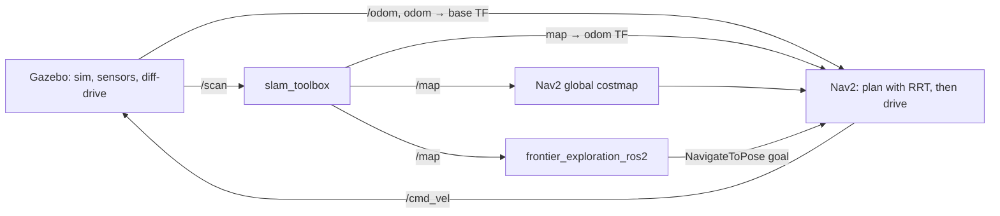

# BurgerStack

An autonomy stack for the TurtleBot3 Burger on ROS 2 Humble. It does three things:

- **Explores and maps an unknown environment on its own**, using `slam_toolbox` for SLAM and frontier-based exploration to decide where to drive next.
- **Plans paths with a custom RRT / RRT\* planner**, running both as a Nav2 global-planner plugin and as a standalone node you can poke at in RViz.
- **Takes natural-language commands** ("go to the chair") and drives there, via an additive semantic-navigation layer that tags what the robot sees and reasons over it later.

Everything runs in Gazebo, is visualized in RViz, and is reproducible through a single [pixi](https://pixi.sh) environment built on [RoboStack](https://robostack.github.io/).

| What you want to see | Run | What happens |
| --- | --- | --- |
| Autonomous exploration + SLAM | `pixi run explore` | The robot drives itself around the house, the occupancy map fills in, and it stops when there's nothing left to explore. |
| The custom RRT planner inside Nav2 | `pixi run bringup`, then use RViz's **Nav2 Goal** tool | The RRT tree grows toward your goal, a path appears, and the controller follows it. |
| Localize on a known map | `pixi run localize-gt`, then send goals | AMCL localizes against a saved occupancy map; no mapping. |
| Natural-language navigation | `pixi run -e ai ai-navigation` (optional AI env) | Send `"go to the chair"` and the robot queries its semantic map, picks the pose, and navigates there. |

> **Cloning:** there's a git submodule (`frontier_exploration_ros2`), so clone with
> `git clone --recursive <url>`. If you already cloned without it, run
> `git submodule update --init --recursive`.

---

## Quickstart

You need [pixi](https://pixi.sh) and git on a Linux x86-64 machine. That's it for the core stack; ROS 2 Humble and every dependency come from the pixi environment. (The optional AI layer in [Semantic navigation](#semantic-navigation) wants an NVIDIA GPU, but nothing else does.)

The repo expects to live in the `src/` directory of a colcon workspace, e.g. `~/ros2_ws/src/BurgerStack`. The build tasks place `build/`, `install/`, and `log/` in the workspace root (two levels up), keeping them out of the repo. If you put it somewhere else, set `COLCON_WS` to your workspace root.

```bash
# from ~/ros2_ws/src/BurgerStack
pixi install          # solve + fetch ROS 2 Humble, Nav2, slam_toolbox, Gazebo, ...
pixi run build        # colcon build --symlink-install
pixi run explore      # full stack + autonomous exploration in the small_house world
```

Gazebo and RViz windows come up; the robot starts driving itself a few seconds after Nav2 activates. Watch the map grow in RViz. When you've mapped enough, save it from a second terminal:

```bash
ros2 run nav2_map_server map_saver_cli -f burger_bringup/maps/map
```

`pixi run` with no task name lists everything available. The full set is in [Task reference](#task-reference).

---

## Architecture

The whole stack is organized around one invariant: **everything shares a single `map` frame and a single occupancy-grid view of the world.** SLAM produces the map and the `map → odom` correction; exploration reads that map to pick goals; the planner plans over it; Nav2's controller drives the robot there.

### Data flow during exploration



When you drive manually instead (`pixi run bringup` and a Nav2 Goal in RViz), the explorer is just absent, and Nav2 still plans every goal with the RRT planner and follows it. For localization-only runs (`pixi run localize`), AMCL replaces `slam_toolbox` and `map_server` serves a static map; nothing else changes.

---

## What's built vs. what's reused

**Reused, mostly unmodified:**

| Component | Role | Why it's reused |
| --- | --- | --- |
| **`slam_toolbox`** | 2D SLAM → `/map` and `map→odom` | Writing a SLAM backend (scan matching, pose graph, loop closure) is a separate multi-month project. It's tuned here, not reimplemented. |
| **Nav2** | Costmaps, controller (DWB), recovery behaviors, behavior tree, lifecycle | The RRT planner plugs into it and the rest is configured, not rewritten. The orchestration and control machinery is stock and battle-tested. |
| **`nav2_map_server` + AMCL** | Serve a saved map / localize against it | Standard localization for the no-SLAM runs. |
| **`frontier_exploration_ros2`** | Frontier detection + exploration policy | Integrated as a git submodule ([mertgulerx/frontier_exploration_ros2](https://github.com/mertgulerx/frontier_exploration_ros2), pinned). A capable open-source explorer already existed; it's wired into the Nav2 stack rather than rebuilding frontier detection. |

**Written from scratch (this repo):**

| Package | What it is |
| --- | --- |
| [`rrt_core`](rrt_core/README.md) | The RRT / RRT\* algorithm as a pure C++ library: no ROS, no grids, unit-tested in isolation. |
| [`rrt_planner`](rrt_planner/README.md) | The ROS 2 integration: a Nav2 `GlobalPlanner` plugin and a standalone planning node, both driven by `rrt_core`. |
| [`burger_bringup`](burger_bringup) | The composition layer: launch files, tuned parameters, RViz configs, URDF, and saved maps that wire the whole thing together. |
| [`burger_worlds`](burger_worlds/README.md) | Vendored Gazebo worlds (`small_house`, `office`) with their models and reference maps. |
| [`semantic_nav/`](semantic_nav/semantic_nav_bringup/README.md) | A six-package layer adding semantic perception, a spatial semantic memory, and agentic natural-language navigation. Purely additive: it touches none of the navigation code above. |

---

## The packages

### Core autonomy

**[`rrt_core`](rrt_core/README.md)** is the planner, with zero ROS in it. It plans in continuous 2D world coordinates and asks an abstract `CollisionChecker` whether a point or a line segment is free. That one decision is what lets a single tested algorithm serve both a raw occupancy grid and a live Nav2 costmap, and what lets the whole thing be unit-tested without a simulator. *Depends on:* nothing but a C++ toolchain.

**[`rrt_planner`](rrt_planner/README.md)** wraps `rrt_core` for ROS in two forms. The **Nav2 plugin** (`rrt_planner/RRTGlobalPlanner`) plans over the global costmap; the **standalone node** (`rrt_planner_node`) plans over a `/map` topic, for development outside the full stack. Both publish the search tree and final path as RViz markers. *Depends on:* `rrt_core`, `nav2_core`, `nav2_costmap_2d`, `pluginlib`.

**`frontier_exploration_ros2`** *(submodule)* detects frontiers (the boundary between mapped and unknown space), scores them, and sends the best one to Nav2 as a `NavigateToPose` goal, looping until the map is complete. It's driven through `burger_bringup` with a tuned [`exploration.yaml`](burger_bringup/params/exploration.yaml). *Depends on:* Nav2, a live `/map`.

**[`burger_worlds`](burger_worlds/README.md)** ships two simulation worlds and everything they need: `small_house` (an AWS RoboMaker residential house, the default) and `office` (the AWS/OSRF ServiceSim). It also ships reference occupancy maps so you can run localization without mapping first. *Depends on:* Gazebo, the TurtleBot3 models.

**[`burger_bringup`](burger_bringup)** is the glue. It writes almost no logic; it composes the stack via launch files (`sim`, `slam`, `nav2`, `localization_amcl`, and the unified `bringup`), parameter files (`slam.yaml`, `nav2.yaml`, `exploration.yaml`), RViz configs, the URDF (including the RGB-D burger variant used by `semantic_nav`), and saved maps. The unified `bringup.launch.py` is the single entry point everything else routes through.

### Semantic navigation

Six packages under [`semantic_nav/`](semantic_nav), summarized in [Semantic navigation](#semantic-navigation) below and documented in full in [`semantic_nav_bringup/README.md`](semantic_nav/semantic_nav_bringup/README.md):

- **`semantic_nav_msgs`** defines the interfaces (semantic objects, map queries, the task action, the build trigger).
- **`semantic_store`** is the pure-Python spatial semantic memory: detection association, ranked retrieval, and JSON persistence. It's the Python counterpart to `rrt_core`.
- **`semantic_perception`** turns RGB-D into 3D detections in the `map` frame, behind a pluggable (mockable) detector.
- **`semantic_mapping`** fuses detections into a semantic map (Phase 1) and serves queries over a saved one (Phase 2).
- **`semantic_reasoning`** is a shared tool layer driven by two frontends: a local ollama agent (the `ExecuteTask` action) and an MCP server for Claude.
- **`semantic_nav_bringup`** composes all of it with the navigation stack into the two-phase demo.

---

## The RRT planner

This is the piece worth understanding in detail, so here's the design; the parameter tables and API live in [`rrt_core/README.md`](rrt_core/README.md) and [`rrt_planner/README.md`](rrt_planner/README.md).

The single most important decision is that **the algorithm knows nothing about ROS, costmaps, or occupancy grids.** `rrt_core::RRT` plans in metric world coordinates and consults a `CollisionChecker` interface for two questions: is this point free, and is this segment free? Everything map-specific hides behind that interface. The payoff is concrete:

- **One algorithm, two data sources.** The standalone node feeds RRT a `GridCollisionChecker` built from a `nav_msgs/OccupancyGrid` (with its own occupancy threshold, unknown-cell policy, and obstacle inflation). The Nav2 plugin feeds it a `CostmapCollisionChecker` that queries the live `nav2_costmap_2d::Costmap2D`, which already carries inflation, so the plugin gets it for free. The two grids even use different value scales (an OccupancyGrid is -1/0..100, a costmap is 0..255), which is exactly why the abstraction earns its keep.
- **It's testable without a robot.** Because the core has no ROS dependency, it's unit-tested with hand-built grids: paths through a wall-with-a-gap, an enclosed goal that fails gracefully, a blocked start, determinism under a fixed seed.

Inside the algorithm: sampling with a goal bias, nearest-neighbour lookup accelerated by a **uniform spatial hash** (so it's roughly O(1) amortized instead of O(n) per iteration), optional **RRT\*** rewiring for shorter paths, and greedy **shortcut smoothing** that collapses a jagged path down to its real inflection points before re-densifying it. The RNG is seeded from a parameter, so runs are reproducible, which matters for both tests and demos.

### Running it

The plugin is already the configured Nav2 global planner ([`nav2.yaml`](burger_bringup/params/nav2.yaml) sets `GridBased.plugin: rrt_planner/RRTGlobalPlanner`), so every goal you send in any non-exploration run is planned by RRT:

```bash
pixi run bringup          # sim + SLAM + Nav2 (RRT) + RViz, no exploration
# then in RViz, use the "Nav2 Goal" tool to send a goal
```

You can also test the planner in isolation, without the controller driving, by calling the `ComputePathToPose` action with `planner_id: GridBased`. For development against a plain map topic, the standalone `rrt_planner_node` (start via RViz's *2D Pose Estimate*, goal via *2D Goal Pose*) is documented in [`rrt_planner/README.md`](rrt_planner/README.md#standalone-planner-node).

---

## Exploration & SLAM

Exploration is the interplay of three things: `slam_toolbox` building the map, `frontier_exploration_ros2` choosing where to go, and Nav2 getting the robot there. The interesting part is the tuning and the sequencing.

**SLAM tuning.** A couple of `slam_toolbox` defaults are wrong for an explorer that makes short hops. `minimum_travel_distance` is lowered so small moves still fold fresh scans into the map, and `map_update_interval` is shortened so newly seen area shows up promptly instead of the explorer acting on a stale map. The tuned values are in [`slam.yaml`](burger_bringup/params/slam.yaml).

**Startup sequencing.** Bringing everything up at once is a race: the explorer will crash Nav2's lifecycle manager if it starts before Nav2 has activated. So `bringup.launch.py` gates each stage on a real readiness signal rather than a fixed sleep. Gazebo comes first, then SLAM/Nav2 once the robot is actually publishing `/scan`, then the explorer once `/navigate_to_pose` is advertised (meaning Nav2 has fully activated). Each wait is bounded by a timeout so a failed bring-up can't deadlock. This is why a heavy world like `office` "just works" without you fiddling with delays.

**Modes.** The `slam_mode` argument picks the map behavior:

```bash
pixi run explore           # mapping from scratch (small_house)
pixi run explore-resume    # continue mapping on the saved map (slam_mode:=continue)
pixi run localize          # AMCL on YOUR saved map.yaml (no mapping)
pixi run localize-gt       # AMCL on the vendored ground-truth map
pixi run explore-debug     # frontier debug overlays, run alongside `explore`

# explore the office world instead (no dedicated task; pass the args directly):
ros2 launch burger_bringup bringup.launch.py explore:=true world:=office x_pose:=-6.0 y_pose:=8.0
```

Save the map at any point with `map_saver_cli` (see [Quickstart](#quickstart)). One gotcha worth knowing: `colcon` symlink-installs the maps directory, so a brand-new map file isn't linked into the install tree until you `pixi run build` once. Save, rebuild, then use it.

---

## Semantic navigation

This layer answers a different question than the rest of the stack: not "how do I get there" but "where *is* the chair?" It's deliberately **additive**: it introduces no new planning or control code, and reuses the same Nav2 `NavigateToPose` action the explorer already uses. The full guide is [`semantic_nav_bringup/README.md`](semantic_nav/semantic_nav_bringup/README.md); the short version is two phases.

**Phase 1: build a semantic map while exploring.** As the robot maps the world, `semantic_perception` takes RGB-D frames, runs an object detector, deprojects detections to 3D, and transforms them into the `map` frame. `semantic_mapping` fuses those into a spatial semantic memory (one entity per real object, with a description, an embedding, and a position), then persists both the semantic map and the occupancy map on a finalize step, either automatically when exploration completes or on demand.

```bash
ros2 launch semantic_nav_bringup semantic_mapping.launch.py world:=office explore:=true rviz:=true
```

**Phase 2: drive by natural language.** The robot localizes (AMCL) against the saved occupancy map, loads the semantic map, and exposes an `ExecuteTask` action. An agentic reasoner turns a command into tool calls (query the semantic map, read the robot pose, navigate) and dispatches a real Nav2 goal:

```bash
ros2 launch semantic_nav_bringup semantic_navigation.launch.py world:=office
ros2 action send_goal /execute_task_node/execute_task \
    semantic_nav_msgs/action/ExecuteTask "{command: 'go to the chair'}" --feedback
```

**Mock-first, real-backend-optional.** Out of the box everything runs with mock detectors, describers, embedders, and reasoning (no GPU, no LLM, no network), so the architecture and the data flow can be exercised and tested anywhere. The real backends (YOLO-World detection, an ollama VLM describer, CLIP embeddings, an ollama tool-calling agent, and an MCP server for Claude) slot in behind the same interfaces with no launch changes, via the optional `ai` pixi environment. See [Environment & reproducibility](#environment--reproducibility) and the [semantic_nav README](semantic_nav/semantic_nav_bringup/README.md#going-from-mock-to-real-backends).

### Driving navigation from Claude (MCP)

The reasoning layer has two interchangeable frontends sitting on one shared tool layer. The `ExecuteTask` action above is the local ollama frontend; the other is an MCP server that lets Claude (Desktop or Code) drive the robot directly. The server exposes the same tools over the [Model Context Protocol](https://modelcontextprotocol.io) (query the semantic map, navigate to a matched object or an explicit pose, read the robot pose). Claude brings its own reasoning loop, so the server only serves tools, it doesn't run the agent itself, and both frontends dispatch through the exact same `RobotTools`.

Start a Phase 2 stack first (ideally the real-backend `pixi run -e ai ai-navigation`, so CLIP text embeddings make a query like "the chair" match by meaning). Then start the MCP server in the `ai` environment, which is where the `mcp` dependency lives:

```bash
pixi run -e ai mcp-server          # = ros2 run semantic_reasoning mcp_server
```

It speaks MCP over stdio (stdout is the protocol channel; logs go to stderr), so register it the way you would any stdio server. In Claude Code, from the repo root:

```bash
claude mcp add semantic-nav -- pixi run -e ai mcp-server
```

In Claude Desktop, add it to `claude_desktop_config.json` with `cwd` pointing at the repo so `pixi` can find the manifest:

```json
{
  "mcpServers": {
    "semantic-nav": {
      "command": "pixi",
      "args": ["run", "-e", "ai", "mcp-server"],
      "cwd": "/path/to/BurgerStack"
    }
  }
}
```

With the server connected, ask Claude in plain language ("where is the chair, and take me there"). It calls the map-query tool, picks a pose, and sends a real Nav2 goal through the running stack, the same path the ollama agent drives. The full server notes are in the [semantic_nav MCP section](semantic_nav/semantic_nav_bringup/README.md#claude--mcp-frontend).

---

## Environment & reproducibility

ROS 2 Humble officially targets Ubuntu 22.04, but this was developed on 24.04 (whose native ROS is Jazzy). Rather than a Docker image or a VM, the whole toolchain is a [pixi](https://pixi.sh) workspace on the [RoboStack](https://robostack.github.io/) channels, which package all of ROS 2 as conda packages. The entire stack (ROS, Nav2, slam_toolbox, Gazebo, the build tools) becomes one `pixi install`, pinned by a lockfile and isolated from the system. [`pixi.toml`](pixi.toml) is the source of truth.

Two details are load-bearing:

- **The Gazebo model-path fixup.** RoboStack's `turtlebot3_gazebo` doesn't register its models with Gazebo the way the Debian package does, so worlds would load empty. An [activation script](scripts/pixi_activate.sh) prepends the models directory to `GAZEBO_MODEL_PATH` and disables the retired online model database (which otherwise hangs `gzserver` on startup).

- **Two environments, two install trees.** The optional AI backends (CUDA PyTorch, YOLO-World, CLIP, ollama, MCP) are heavy and GPU-bound, so they live behind a pixi *feature*. The default environment stays mock-only and GPU/network-free; the `ai` environment adds the ML stack on top of all of ROS. Crucially, each environment builds into and runs from its **own** colcon tree (`install/` vs `install_ai/`). The reason is subtle: `colcon` bakes the building environment's Python interpreter into each node's launch shebang, and a shared tree run under the other environment would load the wrong interpreter and the node would die before it could even log why. Separate trees mean a node is always launched by the very interpreter that built it. The long comment in `pixi.toml` documents this in full.

```bash
# the optional AI layer (one-time, GB-scale download, needs an NVIDIA GPU)
pixi install -e ai
pixi run -e ai ai-build
pixi run -e ai ai-navigation
```

---

## Task reference

`pixi run <task>` runs in the default (mock) environment:

| Task | What it does |
| --- | --- |
| `build` | `colcon build --symlink-install` into `install/`. |
| `rebuild` | Clean build (removes `build/ install/ log/` first). |
| `test` | `colcon test` + `colcon test-result --verbose`. |
| `sim-small-house` | Gazebo + robot only, residential house world. |
| `sim-office` | Gazebo + robot only, office world (spawns at the office pose). |
| `bringup` | Full stack (sim + SLAM + Nav2 + RViz), no exploration; drive manually with Nav2 goals. |
| `explore` | Full stack + autonomous frontier exploration (small_house). |
| `explore-resume` | Resume exploration on the saved map (`slam_mode:=continue`). |
| `localize` | AMCL + map_server on *your* saved `map.yaml`. Send goals from RViz. |
| `localize-gt` | AMCL on the vendored ground-truth occupancy map. |
| `explore-debug` | Frontier debug overlays (raw/optimized frontiers, scores); run alongside `explore`. |

`pixi run -e ai <task>` runs in the optional AI environment (separate `install_ai/` tree):

| Task | What it does |
| --- | --- |
| `ai-build` / `ai-rebuild` | Build into `install_ai/` with the AI environment's interpreter. |
| `ai-mapping` | Phase 1 with real perception + enrichment. |
| `ai-navigation` | Phase 2 with CLIP-based queries and the ollama reasoning agent. |
| `mcp-server` | Run the MCP server exposing the semantic tools to Claude. |

---

## Testing

```bash
pixi run test
```

The testing strategy is to **validate at the lowest level that can catch a given class of bug**, because the cheap levels are where most bugs actually are:

- **Algorithm correctness → pure unit tests, no ROS.** `rrt_core` (grid conversions, inflation, paths around walls, determinism, RRT\* path quality) and the Python `semantic_store` / perception / mapping / reasoning logic all test as plain libraries: no graph, no simulator, no GPU.
- **Single-node ROS behavior → scripted probes.** Publish a synthetic map + start + goal and assert a sensible path comes back; call `ComputePathToPose` and assert a non-empty path. These catch QoS, interface, and costmap-policy bugs without a simulator.
- **Whole-system behavior → a headless sim run.** The exploration livelock and the SLAM/explorer parameter interaction only show up when the full stack runs end to end, so that's the level you run to trust the integration.

---

## Repository layout

```
BurgerStack/
├── pixi.toml                    # RoboStack / ROS 2 Humble environment + task runner
├── scripts/pixi_activate.sh     # Gazebo model-path & database fixups on activation
├── rrt_core/                    # RRT / RRT* algorithm library (pure C++, no ROS)
├── rrt_planner/                 # Nav2 global-planner plugin + standalone node
├── frontier_exploration_ros2/   # vendored explorer (git submodule)
├── burger_worlds/               # Gazebo worlds (small_house, office) + reference maps
├── burger_bringup/              # launch / params / rviz / urdf / maps (the composition layer)
└── semantic_nav/                # natural-language semantic navigation (6 packages)
    ├── semantic_nav_msgs/
    ├── semantic_store/
    ├── semantic_perception/
    ├── semantic_mapping/
    ├── semantic_reasoning/
    └── semantic_nav_bringup/
```

---

## Troubleshooting

**The robot won't move.** Check, in order: is the TF tree complete (`map → odom → base_footprint` all present)? Is Nav2's lifecycle manager reporting "active"? Does the costmap cover the robot? Is the goal in free, known, non-inflated space? Is `/cmd_vel` actually being published? Most "won't move" bugs are one of these, and they're quickest to find in that order.

**A new map isn't picked up.** `colcon` symlink-installs the maps directory, so save the map, run `pixi run build` once to link it, then launch.

**Semantic Phase 2 goals land in the wrong place.** The semantic map stores positions in the `map` frame of the Phase-1 SLAM session. Phase 2 must localize against the occupancy map saved from *that same session* (the default), not a different one; otherwise the origins disagree and goals are offset.

**Gazebo hangs on startup or worlds load empty.** You're not in the pixi environment, so the activation script never ran. Use `pixi run <task>` (or `pixi shell` first).

---

## Demo

<!-- Drop screenshots / a screen recording here once captured. Suggestions:

  
  Capture: `pixi run explore`, then screen-record the RViz window as the map fills in.

  
  Capture: `pixi run bringup`, send a Nav2 Goal, screenshot the tree (blue) + path (green).

  
  Capture: `pixi run -e ai ai-navigation`, send "go to the chair", record the drive.

To record a run for later playback: `ros2 bag record -a` while the stack is up. -->

_Media to be added._
