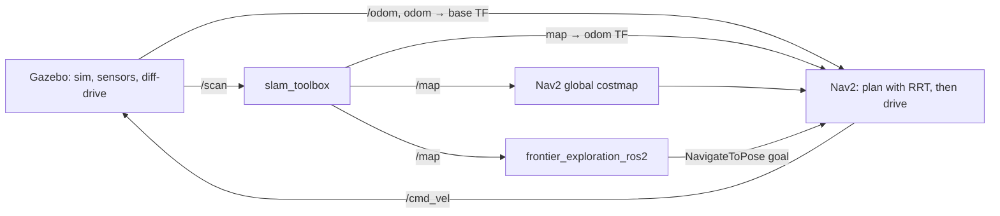
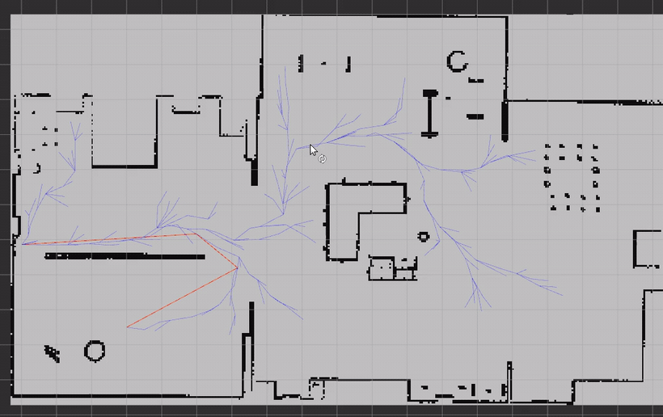

# BurgerStack

An autonomy stack for the TurtleBot3 Burger on ROS 2 Humble. It does three things:

- **Explores and maps an unknown environment on its own**, using `slam_toolbox` for SLAM and frontier-based exploration to decide where to drive next.
- **Plans paths with a custom RRT / RRT\* planner**, running both as a Nav2 global-planner plugin and as a standalone node you can poke at in RViz.
- **Takes natural-language commands** ("go to the chair") and drives there, via an additive semantic-navigation layer that tags what the robot sees and reasons over it later.

Everything runs in Gazebo, is visualized in RViz, and is reproducible through a single [pixi](https://pixi.sh) environment built on [RoboStack](https://robostack.github.io/).

| What you want to see | Run | What happens |
| --- | --- | --- |
| Autonomous exploration + SLAM | `pixi run explore` | The robot drives itself around the house, the occupancy map fills in, and it stops when there's nothing left to explore. |
| The custom RRT planner inside Nav2 | `pixi run bringup`, then use RViz's **Nav2 Goal** tool | The RRT tree grows toward your goal, a path appears, and the controller follows it. |
| Localize on a known map | `pixi run localize-gt`, then send goals | AMCL localizes against a saved occupancy map; no mapping. |
| Natural-language navigation | `pixi run -e ai ai-navigation` (optional AI env) | Send `"go to the chair"` and the robot queries its semantic map, picks the pose, and navigates there. |

> **Cloning:** there's a git submodule (`frontier_exploration_ros2`), so clone with
> `git clone --recursive <url>`. If you already cloned without it, run
> `git submodule update --init --recursive`.

---

## Quickstart

You need [pixi](https://pixi.sh) and git on a Linux x86-64 machine. That's it for the core stack; ROS 2 Humble and every dependency come from the pixi environment. (The optional AI layer in [Semantic navigation](#semantic-navigation) wants an NVIDIA GPU, but nothing else does.)

The repo expects to live in the `src/` directory of a colcon workspace, e.g. `~/ros2_ws/src/BurgerStack`. The build tasks place `build/`, `install/`, and `log/` in the workspace root (two levels up), keeping them out of the repo. If you put it somewhere else, set `COLCON_WS` to your workspace root.

```bash
# from ~/ros2_ws/src/BurgerStack
pixi install          # solve + fetch ROS 2 Humble, Nav2, slam_toolbox, Gazebo, ...
pixi run build        # colcon build --symlink-install
pixi run explore      # full stack + autonomous exploration in the small_house world
```

Gazebo and RViz windows come up; the robot starts driving itself a few seconds after Nav2 activates. Watch the map grow in RViz. When you've mapped enough, save it from a second terminal:

```bash
ros2 run nav2_map_server map_saver_cli -f burger_bringup/maps/map
```

`pixi run` with no task name lists everything available. The full set is in [Task reference](#task-reference).

---

## Architecture

The whole stack is organized around one invariant: **everything shares a single `map` frame and a single occupancy-grid view of the world.** SLAM produces the map and the `map → odom` correction; exploration reads that map to pick goals; the planner plans over it; Nav2's controller drives the robot there.

### Data flow during exploration



When you drive manually instead (`pixi run bringup` and a Nav2 Goal in RViz), the explorer is just absent, and Nav2 still plans every goal with the RRT planner and follows it. For localization-only runs (`pixi run localize`), AMCL replaces `slam_toolbox` and `map_server` serves a static map; nothing else changes.

---

## Packages

**Reused, mostly unmodified:**

| Component | Role | Why it's reused |
| --- | --- | --- |
| **`slam_toolbox`** | 2D SLAM, producing `/map` and the `map → odom` correction | Writing a SLAM backend (scan matching, pose graph, loop closure) is a separate multi-month project. It's tuned here, not reimplemented. |
| **Nav2** | Costmaps, controller (DWB), recovery behaviors, behavior tree, lifecycle | The RRT planner plugs into it and the rest is configured, not rewritten. The orchestration and control machinery is stock and battle-tested. |
| **`nav2_map_server` + AMCL** | Serve a saved map, localize against it | Standard localization for the no-SLAM runs. |
| **`frontier_exploration_ros2`** | Frontier detection + exploration policy | Integrated as a git submodule ([mertgulerx/frontier_exploration_ros2](https://github.com/mertgulerx/frontier_exploration_ros2), pinned). A capable open-source explorer already existed; it's wired into the Nav2 stack rather than rebuilding frontier detection. |

**Written from scratch (this repo), each with its own README for the design and parameter detail:**

| Package | What it is |
| --- | --- |
| [`rrt_core`](rrt_core/README.md) | The RRT / RRT\* algorithm as a pure C++ library: no ROS, no grids, unit-tested in isolation. |
| [`rrt_planner`](rrt_planner/README.md) | The ROS 2 integration: a Nav2 `GlobalPlanner` plugin and a standalone planning node, both driven by `rrt_core`. |
| [`burger_bringup`](burger_bringup) | The composition layer (no README of its own): launch files (`sim`, `slam`, `nav2`, `localization_amcl`, and the unified `bringup`), tuned parameter files, RViz configs, the URDF (including the RGB-D burger variant `semantic_nav` uses), and saved maps. `bringup.launch.py` is the single entry point everything else routes through. |
| [`burger_worlds`](burger_worlds/README.md) | Vendored Gazebo worlds (`small_house`, `office`) with their models and reference occupancy maps. |
| [`semantic_nav/`](semantic_nav/README.md) | A six-package layer adding semantic perception, a spatial semantic memory, and agentic natural-language navigation. Purely additive: it touches none of the navigation code above. |

The two pieces worth understanding in depth, the RRT planner and the semantic layer, are summarized below.

---

## The RRT planner

The planner is the main piece written from scratch, so here is the core idea; the algorithm walkthrough, parameter tables, and API live in [`rrt_core/README.md`](rrt_core/README.md) and [`rrt_planner/README.md`](rrt_planner/README.md).



*The standalone planner (`pixi run plan-demo`) on the saved `small_house` map: no Gazebo, just `/map` plus a start and a goal, producing a `nav_msgs/Path`. The RRT/RRT\* tree (blue) explores the free space while the path (red) re-plans to each new goal.*

The single load-bearing decision is that **the algorithm knows nothing about ROS, costmaps, or occupancy grids.** `rrt_core::RRT` plans in metric world coordinates and consults a `CollisionChecker` interface for two questions: is this point free, and is this segment free? That one abstraction lets a single tested algorithm drive two very different data sources. The standalone node feeds it a `GridCollisionChecker` built from a `nav_msgs/OccupancyGrid`; the Nav2 plugin feeds it a `CostmapCollisionChecker` over the live `nav2_costmap_2d::Costmap2D`, which already carries inflation. Because the core has no ROS dependency, it is also unit-tested without a robot, against hand-built grids. The sampling, spatial-hash nearest-neighbour lookup, RRT\* rewiring, and greedy smoothing are all covered in [`rrt_core/README.md`](rrt_core/README.md).

### Running it

The plugin is already the configured Nav2 global planner ([`nav2.yaml`](burger_bringup/params/nav2.yaml) sets `GridBased.plugin: rrt_planner/RRTGlobalPlanner`), so every goal you send in any non-exploration run is planned by RRT:

```bash
pixi run bringup          # sim + SLAM + Nav2 (RRT) + RViz, no exploration
# then in RViz, use the "Nav2 Goal" tool to send a goal
```

You can also run the planner standalone on the saved map with no Gazebo, the Section-3 "occupancy grid + start + goal -> `nav_msgs/Path`" demo:

```bash
pixi run plan-demo        # map_server (saved map) + rrt_planner_node + RViz
# then in RViz use the "2D Goal Pose" tool to send a goal
```

The standalone node's topics and parameters are documented in [`rrt_planner/README.md`](rrt_planner/README.md#standalone-planner-node).

---

## Exploration & SLAM

Exploration is the interplay of three things: `slam_toolbox` building the map, `frontier_exploration_ros2` choosing where to go, and Nav2 getting the robot there. The interesting part is the tuning and the sequencing.


*`pixi run explore`: frontier-driven autonomous exploration of `small_house`. Gazebo (left) and, in RViz (right), the SLAM map filling in with inflated costmaps, frontier markers, and the live Nav2 path as the robot drives itself around.*

**SLAM tuning.** A couple of `slam_toolbox` defaults are wrong for an explorer that makes short hops. `minimum_travel_distance` is lowered so small moves still fold fresh scans into the map, and `map_update_interval` is shortened so newly seen area shows up promptly instead of the explorer acting on a stale map. The tuned values are in [`slam.yaml`](burger_bringup/params/slam.yaml).

**Startup sequencing.** Bringing everything up at once is a race: the explorer will crash Nav2's lifecycle manager if it starts before Nav2 has activated. So `bringup.launch.py` gates each stage on a real readiness signal rather than a fixed sleep. Gazebo comes first, then SLAM/Nav2 once the robot is actually publishing `/scan`, then the explorer once `/navigate_to_pose` is advertised (meaning Nav2 has fully activated). Each wait is bounded by a timeout so a failed bring-up can't deadlock. This is why a heavy world like `small_house` "just works" without you fiddling with delays.

**Modes.** The `slam_mode` argument picks the map behavior:

```bash
pixi run explore           # mapping from scratch (small_house)
pixi run explore-resume    # continue mapping on the saved map (slam_mode:=continue)
pixi run localize          # AMCL on YOUR saved map.yaml (no mapping)
pixi run localize-gt       # AMCL on the vendored ground-truth map
pixi run explore-debug     # frontier debug overlays, run alongside `explore`

# explore the office world instead (no dedicated task; pass the args directly):
ros2 launch burger_bringup bringup.launch.py explore:=true world:=office x_pose:=-6.0 y_pose:=8.0
```

Save the map at any point with `map_saver_cli` (see [Quickstart](#quickstart)). One gotcha worth knowing: `colcon` symlink-installs the maps directory, so a brand-new map file isn't linked into the install tree until you `pixi run build` once. Save, rebuild, then use it.

> `explore-resume` resumes a serialized `slam_toolbox` **pose-graph** (`burger_bringup/maps/map.posegraph` + `.data`), which is a different artifact from the `.pgm`/`.yaml` occupancy map and is **not** shipped in the repo. Create one during an `explore` run via slam_toolbox's *Serialize Map* RViz panel (or `ros2 service call /slam_toolbox/serialize_map ...`), saved at base name `burger_bringup/maps/map`, then `explore-resume` will continue from it.

---

## Semantic navigation

This layer answers a different question than the rest of the stack: not "how do I get there" but "where *is* the chair?" It is deliberately **additive**, introducing no new planning or control code and reusing the same Nav2 `NavigateToPose` action the explorer already uses. The design (how labels are generated, stored, and queried) lives in [`semantic_nav/README.md`](semantic_nav/README.md); the full run guide, the mock-to-real switch, and the Claude/MCP setup live in [`semantic_nav_bringup/README.md`](semantic_nav/semantic_nav_bringup/README.md).

Natural-language navigation driven by **Claude through the MCP server**: *"find the trash can in the robot's semantic map and drive the robot to it,"* then *"now take the robot to the refrigerator."* Claude loads the tool schemas, queries the semantic map (matching the object by label/embedding), and dispatches a real Nav2 goal that the custom RRT planner solves:

<table>
  <tr>
    <td width="50%"><b>Claude reasoning over MCP</b><br/></td>
    <td width="50%"><b>RViz: semantic map, RRT path, robot</b><br/></td>
  </tr>
  <tr>
    <td><b>Gazebo: the house</b><br/></td>
    <td><b>Robot onboard camera</b><br/></td>
  </tr>
</table>

> The four panels are one synchronized run: Claude's tool calls (top-left) drive the robot to the trash can, then the refrigerator, with the plan and drive shown in RViz (top-right), Gazebo (bottom-left), and the robot's camera (bottom-right).

It runs in two phases that share the SLAM `map` frame:

- **Phase 1, build a semantic map while exploring.** `semantic_perception` turns RGB-D frames into 3D detections in the `map` frame; `semantic_mapping` fuses them into one entity per real object (description, embedding, position) and persists both the semantic map and the occupancy map on a finalize step.
- **Phase 2, drive by natural language.** The robot localizes (AMCL) against the saved occupancy map, loads the semantic map, and exposes an `ExecuteTask` action (or the MCP server for Claude). A reasoner turns a command into tool calls and dispatches a real Nav2 goal.

```bash
# Phase 1: build the semantic map while exploring
ros2 launch semantic_nav_bringup semantic_mapping.launch.py world:=small_house explore:=true rviz:=true
# Phase 2: drive by natural language
ros2 launch semantic_nav_bringup semantic_navigation.launch.py world:=small_house
ros2 action send_goal /execute_task_node/execute_task \
    semantic_nav_msgs/action/ExecuteTask "{command: 'go to the chair'}" --feedback
```

Everything runs **mock-first** out of the box (no GPU, LLM, or network), so the architecture and data flow can be exercised and tested anywhere. The real backends (YOLO-World detection, an ollama VLM describer, CLIP embeddings, an ollama tool-calling agent, and the MCP server for Claude) slot in behind the same interfaces with no launch changes, via the optional `ai` pixi environment. Running each phase against the real backends is covered in [`semantic_nav_bringup/README.md`](semantic_nav/semantic_nav_bringup/README.md#going-from-mock-to-real-backends).

### Driving from Claude (MCP)

The reasoning layer has two interchangeable frontends on one shared tool layer: the local ollama agent (`ExecuteTask`) above, and an MCP server that lets Claude drive the robot directly over the [Model Context Protocol](https://modelcontextprotocol.io). Start a Phase 2 stack (ideally the real-backend `pixi run -e ai ai-navigation`, so CLIP text embeddings make "the chair" match by meaning), then start the server in the `ai` environment, where the `mcp` dependency lives:

```bash
pixi run -e ai mcp-server          # = ros2 run semantic_reasoning mcp_server
```

It speaks MCP over stdio, so register it like any stdio server. In Claude Code, from the repo root:

```bash
claude mcp add semantic-nav -- pixi run -e ai mcp-server
```

In Claude Desktop, add it to `claude_desktop_config.json` with `cwd` pointing at the repo so `pixi` can find the manifest:

```json
{
  "mcpServers": {
    "semantic-nav": {
      "command": "pixi",
      "args": ["run", "-e", "ai", "mcp-server"],
      "cwd": "/path/to/BurgerStack"
    }
  }
}
```

With the server connected, ask Claude in plain language ("where is the chair, and take me there"); it queries the map, picks a pose, and sends a real Nav2 goal through the running stack, the same path the ollama agent drives. Server internals are in the [semantic_nav MCP notes](semantic_nav/semantic_nav_bringup/README.md#claude--mcp-frontend).

---

## Environment & reproducibility

ROS 2 Humble officially targets Ubuntu 22.04, but this was developed on 24.04 (whose native ROS is Jazzy). Rather than a Docker image or a VM, the whole toolchain is a [pixi](https://pixi.sh) workspace on the [RoboStack](https://robostack.github.io/) channels, which package all of ROS 2 as conda packages. The entire stack (ROS, Nav2, slam_toolbox, Gazebo, the build tools) becomes one `pixi install`, pinned by a lockfile and isolated from the system. [`pixi.toml`](pixi.toml) is the source of truth.

Two details are load-bearing:

- **The Gazebo model-path fixup.** RoboStack's `turtlebot3_gazebo` doesn't register its models with Gazebo the way the Debian package does, so worlds would load empty. An [activation script](scripts/pixi_activate.sh) prepends the models directory to `GAZEBO_MODEL_PATH` and disables the retired online model database (which otherwise hangs `gzserver` on startup).

- **Two environments, two install trees.** The optional AI backends (CUDA PyTorch, YOLO-World, CLIP, ollama, MCP) are heavy and GPU-bound, so they live behind a pixi *feature*. The default environment stays mock-only and GPU/network-free; the `ai` environment adds the ML stack on top of all of ROS. Crucially, each environment builds into and runs from its **own** colcon tree (`install/` vs `install_ai/`). The reason is subtle: `colcon` bakes the building environment's Python interpreter into each node's launch shebang, and a shared tree run under the other environment would load the wrong interpreter and the node would die before it could even log why. Separate trees mean a node is always launched by the very interpreter that built it. The long comment in `pixi.toml` documents this in full.

```bash
# the optional AI layer (one-time, GB-scale download, needs an NVIDIA GPU)
pixi install -e ai
pixi run -e ai ai-build
pixi run -e ai ai-navigation
```

---

## Task reference

`pixi run <task>` runs in the default (mock) environment:

| Task | What it does |
| --- | --- |
| `build` | `colcon build --symlink-install` into `install/`. |
| `rebuild` | Clean build (removes `build/ install/ log/` first). |
| `test` | `colcon test` + `colcon test-result --verbose`. |
| `sim-small-house` | Gazebo + robot only, residential house world. |
| `sim-office` | Gazebo + robot only, office world (spawns at the office pose). |
| `bringup` | Full stack (sim + SLAM + Nav2 + RViz), no exploration; drive manually with Nav2 goals. |
| `plan-demo` | Standalone RRT planner on the saved map (no Gazebo): `map_server` + `rrt_planner_node` + RViz. Set a goal with RViz's *2D Goal Pose*; watch the tree + path. |
| `explore` | Full stack + autonomous frontier exploration (small_house). |
| `explore-resume` | Resume exploration from a serialized slam_toolbox pose-graph (`slam_mode:=continue`). Requires `maps/map.posegraph`+`.data`, which aren't shipped, so serialize one first (see [Exploration & SLAM](#exploration--slam)). |
| `localize` | AMCL + map_server on *your* saved `map.yaml`. Send goals from RViz. |
| `localize-gt` | AMCL on the vendored ground-truth occupancy map. |
| `explore-debug` | Frontier debug overlays (raw/optimized frontiers, scores); run alongside `explore`. |

`pixi run -e ai <task>` runs in the optional AI environment (separate `install_ai/` tree):

| Task | What it does |
| --- | --- |
| `ai-build` / `ai-rebuild` | Build into `install_ai/` with the AI environment's interpreter. |
| `ai-mapping` | Phase 1 with real perception + enrichment. |
| `ai-navigation` | Phase 2 with CLIP-based queries and the ollama reasoning agent. |
| `mcp-server` | Run the MCP server exposing the semantic tools to Claude. |

---

## Testing

```bash
pixi run test
```

The testing strategy is to **validate at the lowest level that can catch a given class of bug**, because the cheap levels are where most bugs actually are:

- **Algorithm correctness, pure unit tests, no ROS.** `rrt_core` (grid conversions, inflation, paths around walls, determinism, RRT\* path quality) and the Python `semantic_store` / perception / mapping / reasoning logic all test as plain libraries: no graph, no simulator, no GPU.
- **Single-node ROS behavior, scripted probes.** Publish a synthetic map + start + goal and assert a sensible path comes back; call `ComputePathToPose` and assert a non-empty path. These catch QoS, interface, and costmap-policy bugs without a simulator.
- **Whole-system behavior, a headless sim run.** The exploration livelock and the SLAM/explorer parameter interaction only show up when the full stack runs end to end, so that's the level you run to trust the integration.
