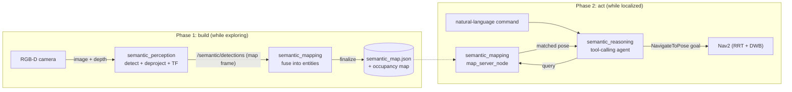

# semantic_nav: agentic semantic reasoning & natural-language navigation

A six-package ROS 2 layer that lets the TurtleBot3 Burger **associate semantic
meaning with the places it sees** and later **navigate to them from a natural-
language command** ("go to the chair"). It is **purely additive**: it introduces
no new planning or control code and reuses the same Nav2 `NavigateToPose` action
the explorer and manual goals already use.

This document is the **design**: how semantic labels are *generated*, *stored*,
and *queried*. For how to **run** the two-phase demo (commands, arguments, the
mock→real switch, the Claude/MCP frontend), see
[`semantic_nav_bringup/README.md`](semantic_nav_bringup/README.md).

## The idea

A robot exploring an office builds a spatial map (occupancy grid) with SLAM. A
*human* who walked the same office also remembers "the toilet is back there, the
meeting room is to the left." This layer gives the robot that second, **semantic**
map, and a way to act on it. It runs in two phases that share the SLAM `map`
frame:



## How semantic labels are generated

`semantic_perception` turns raw RGB-D into 3D, `map`-frame detections:

1. **Detect**: an RGB frame goes through a detector that returns labelled 2D
   boxes. The detector is an interface; the default is a `MockDetector` (a single
   centered box), and the real backend is **YOLO-World** (open-vocabulary: you
   pass it a vocabulary list like `["chair", "toilet", "desk", ...]`).
2. **Deproject**: each box is projected into the camera frame using the depth
   image and the camera intrinsics (`fx, fy, cx, cy`), giving a 3D point.
3. **Transform**: TF chains that point through `camera → base_link → … → map`,
   so every detection is anchored in the same global frame as the occupancy map.

The result is a `DetectionArray` (each `Detection` carries the label, confidence,
3D position, and the cropped image patch) published on `/semantic/detections`.

## How they're stored

`semantic_mapping`'s **Phase-1 builder** (`mapping_node`) fuses the stream of
detections into a **spatial semantic memory** (`semantic_store`, a pure-Python
library that is the Python counterpart of `rrt_core`):

- **Association**: a new detection near an existing entity of the same label
  updates that entity (running-average position, best-confidence crop) rather
  than creating a duplicate, so one real object becomes **one entity**.
- **Enrichment** (on finalize): each entity's best crop is run through a
  **describer** (mock, or an ollama VLM like *moondream*) for a natural-language
  description, and an **embedder** (mock, or **CLIP**) for a vector embedding;
  nearby entities are grouped into **regions**.
- **Persistence**: the store serializes to `semantic_map.json`:
  `{label, description, embedding, position (map frame), confidence, region}`
  per entity. The occupancy map is saved alongside it in the same step.

## How they're queried

`semantic_mapping`'s **Phase-2 server** (`map_server_node`) loads the saved
`semantic_map.json` and exposes a `QuerySemanticMap` service. Queries are **not
hard-coded**: the service accepts any of:

- **by label** (substring match), **spatial** (near a point within a radius), or
  **by region**, and most importantly
- **by text**: the query string is embedded with the *same* embedder used at
  build time (CLIP), and entities are ranked by **cosine similarity** in the
  shared image/text space. This is what makes "where is the toilet?" match an
  entity even if its stored label was "urinal" or its description mentions a
  restroom.

A query returns ranked `SemanticObject`s with their `map`-frame poses.

## How it acts (reasoning)

`semantic_reasoning` is a **shared tool layer** (one `ToolRegistry` exposing
`query_semantic_map`, `get_robot_pose`, and `navigate_to_pose`/`navigate_to_object`)
driven by two interchangeable frontends:

- **ollama agent** (`execute_task_node`): an `ExecuteTask` action. A local
  tool-calling LLM (e.g. qwen2.5) turns the command into a sequence of tool calls
  (query the map → pick a pose → navigate) and dispatches a **real Nav2 goal**.
- **MCP server** (`mcp_server`): exposes the *same* tools to Claude over the
  Model Context Protocol; Claude brings its own reasoning loop. Both frontends
  dispatch through the identical `RobotTools`.

Either way the final action is an ordinary `NavigateToPose` goal; the robot
plans (with the custom RRT planner) and drives there using the existing stack.

## The packages

| Package | What it is |
| --- | --- |
| `semantic_nav_msgs` | The interfaces: `SemanticObject(Array)`, `Detection(Array)`, `QuerySemanticMap` service, `ExecuteTask` action, the build/finalize triggers. |
| `semantic_store` | Pure-Python spatial semantic memory: association, ranked retrieval (label/spatial/region/embedding), JSON persistence. No ROS. |
| `semantic_perception` | RGB-D → 3D `map`-frame detections, behind a pluggable (mockable) detector. |
| `semantic_mapping` | Phase-1 builder (`mapping_node`) + Phase-2 query server (`map_server_node`) + the `map_finalizer` handoff. |
| `semantic_reasoning` | The shared tool layer + the two frontends (`execute_task_node`, `mcp_server`). |
| `semantic_nav_bringup` | Launch / params / RViz that compose all of the above with `burger_bringup`'s navigation stack. |

## Two design invariants worth knowing

- **Mock-first, real-backend-optional.** Every AI component (detector, describer,
  embedder, reasoning backend) sits behind an interface with a deterministic mock
  default, so the entire architecture and data flow run (and unit-test) with no
  GPU, LLM, or network. The real backends (YOLO-World, ollama VLM, CLIP, ollama
  agent) slot in behind the same interfaces with no launch changes, via the
  optional `ai` pixi environment. See
  [the mock→real guide](semantic_nav_bringup/README.md#going-from-mock-to-real-backends).
- **Map-frame consistency.** Semantic positions live in the `map` frame of the
  Phase-1 SLAM session. Phase 2 must localize against the occupancy map saved from
  *that same session* (the default), or the origins disagree and goals are
  offset. See the
  [note in the bringup README](semantic_nav_bringup/README.md#important-map-frame-consistency).

## Running it

All commands, arguments, the mock→real switch, and the Claude/MCP setup are in
**[`semantic_nav_bringup/README.md`](semantic_nav_bringup/README.md)**. The short
version:

```bash
# Phase 1: build the semantic map while exploring
ros2 launch semantic_nav_bringup semantic_mapping.launch.py world:=small_house explore:=true rviz:=true
# Phase 2: drive by natural language
ros2 launch semantic_nav_bringup semantic_navigation.launch.py world:=small_house
ros2 action send_goal /execute_task_node/execute_task \
    semantic_nav_msgs/action/ExecuteTask "{command: 'go to the chair'}" --feedback
```
